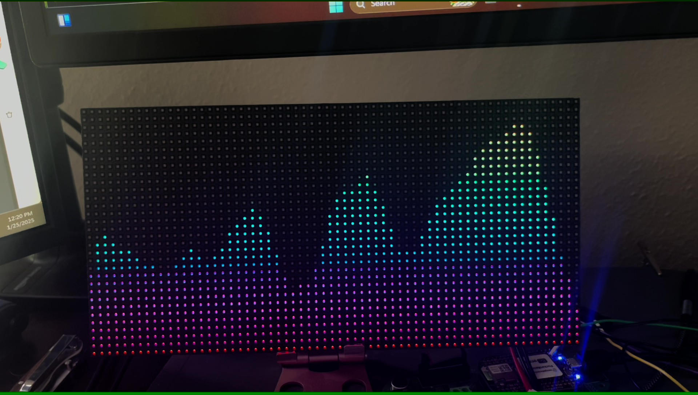

# Pocket Beagle Audio Visualizer with LED matrix

Audio visualization is neat so I made a gadget with PocketBeagle for the hell of it! 

[See longer video below](./README.md#video-of-the-thing)

## Project Summary

I made a PCB ("cape" in Beagle terminology) that has an audio jack + electret mic to capture and amplify audio, plus the output cabling for a [LED panel from Adafruit](https://www.adafruit.com/product/2278) (but my extras were cheapo Aliexpress/where-ever and work identically). 

The PocketBeagle (PB) has an AM335x processor for the processing. I capture audio with ADC input in chunks with a sliding window -- sampling rate was set based on processing speed (unoptimized w/ numpy calls) and responsiveness. Audio is processed with FFT -> power log spectrum -> log-frequency power spectrum to make the basis for the image. The image is then an opencv color mapping for each (pseudo-log) frequency bin's power, and send to the PRU via /dev/mem so it can be displayed to the 64x32 LED matrix. The PRU is running a driver to display 8-bit color images, FPS somewhere in 20-30 range.

I chose a pocket beagle, partly because I've worked as an Apps Engineer at TI, partly b I have met the awesome Beagle folks several times, and partly bc I wanted to try running on an SoC with fast IO core + reasonable A-core running Linux. It's worked out well, and the examples were definitely present enough out there to get me started on all aspects of the project. That said, it helps a lot to have worked professionally with such devices to heterogeneous SoCs running a mixture of HLOS/RTOS/No-OS (esp. including Linux) and have a signal processing / embedded systems background. 

## V1 Details

First version of this project is complete as of 2024 EoY. I started sometime in 2023, but didn't put much time into it / slowed down by silly roadblocks. 

This v1 includes:
* Custom cape (PCB that beagle board attaches to) that provides audio input and image output signalling to the matrix panel
   * Revisions needed to reduce analog noise, reduce pinout/external connection, etc.
* PRU code that reads an image from shared memory, and manages output pins for the matrix such that we visualize an 8-bit, 32x64 pixel image. 
   * Framerate is 20-30 FPS and looks about reasonably smooth and responsive, albeit a bit jittery
* Updated device tree overlay for setting ADC configuartion (20kS/s) (see [dtb](./dtb/) files)
   * Data arrives through IIO driver and read with sysfs
   * I noted that bb-overlay repo (origin of these DTS) has an ./install.sh that doesn't work. I had to look in /boot/uEnv.txt to apply the DTBO file (name_overlays)
   * Sampling rate was chosen based on processing speed vs. responsiveness. I wanted 40 kS/s for 20 kHz bandwidth, but this just wasn't feasible. As a result, I have some aliasing in the upper bands that I'll need to resolve later. 
* A bunch of python code to do the audio capture, processing (FFTs and such), and image generation
   * I signal to the PRU by opening /dev/mem to access the whole memory space and write to PRU's shared SRAM. Images too big for rpmsg anyway. 
      * In theory though (thx Jason K. for the tip), I can just alloc a chunk of DDR and access that between both cores -- should be fast enough, but maybe still need double-buffer.
   * Buffer sizes, sampling rates, and processing code are tuned to be snappy -- audio sync tests look visually acceptable (<200ms). Image processing at >30fps, unsure about display
   * I have some filtering to make the frequency bands look smoother in both space (pixels) and time (frames). Could spend lots of time tuning.
   * Add some power switches
   * Check signal levels on home audio system and see if I need to reduce / amplify voltage. Almost certainty the former per Klipsch RP-600m, but must measure at realistic listening level

The fact that this works with Python code and limited optimizations shows that AM335x is still a plenty beefy processor. I'm at ~70% utilization of the 1x A8. That said, I really want a new revision of pocket beagle with a more modern (probably TI) processor, so long as there's a PRU. I'll be keeping an eye out for a new PB iteration ;)  But This would probably also mean a few extra components on the PCB for ADC

The actual code itself for this application is under . There's a main runner script that will turn off the PRU, rebuild firmware, start PRU, apply sysfs settings for ADC capture, and kick off the audio processing + image generation
* My WIP code was put under , and I don't really plan to reorganize this. It's a few piecemeal examples of things like matrix-pru driver, image-generation, sending images to the PRU, audio capture, audio processing 
* Worth noting, my method of sharing images to 

### TODOs in a v2

I got to MVP / PoC, but I know there's more I can do to improve this. Some of those things include (roughly prioritized):

0. Put on beagleprojects with a guide to replicating v1
1. Revise matrix cape to improve signal quality and have easier connections
   - Add low pass filter to have a ~10kHz knee (2-3 taps) to reduce the aliasing I get from 20kS/s samplerate
       * If I can get processing loop fast enough, I can go faster and use 30-40kS/s, but it's diminishing returns on these bands anyway
   - Allow pocket beagle to be powered by 5V from matrix power supply. Have to be careful with USB power though.
       * Also need LDO for matrix
   - Eliminate ground loop that's giving me ugly low frequency noise around 60 Hz
   - Better connector to 5V matrix power supply
2. Measure realizable framerate for single matrix w/ 8-bit color
3. Try extending to a second matrix for longer length
   - Would likely include changing image location for PRU access to be in DDR
   - Will also need to consider realizable framerate relative and bit-depth for ~30 fps
4. Get mounting hardware to affix cape to the matrix panel. Should already have the right footprint for 2.5mm screws 
5. Set explicit FPS target on both display driver and image generation code to make this smoother

And if a PB2 comes out that will work as well, then I'll switch to that. I can burn extra processing on nonsense like:
* beat detection to get a BPM counter/tracker for music
* text display in the top 1/4 of the display
* Shazam or similar API on the backend to identify and print song artist??
   - This might not be free, but would be awesome

But I still want a PRU for the signalling. I suppose newer TI processors have more R5's and similar MCU cores which may be a good alternative, but that seems like more work to port.

##### Video of the thing

